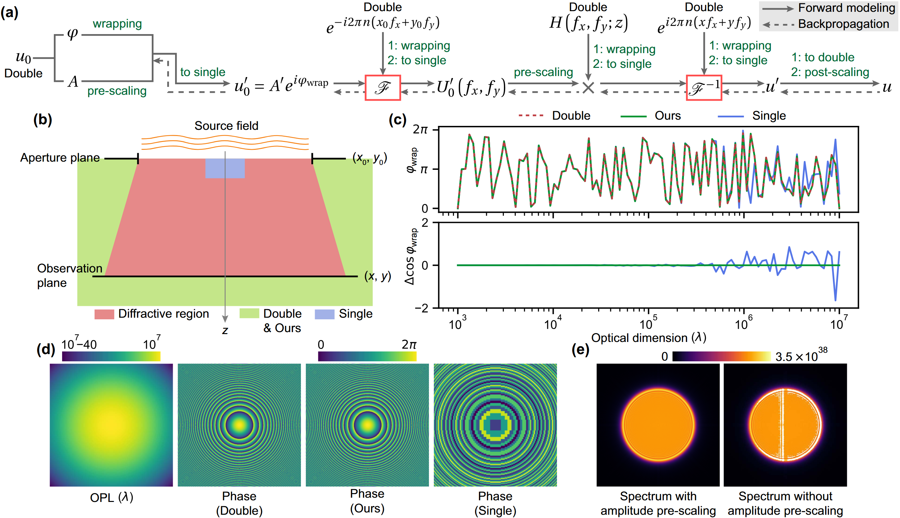

# Accurate wave propagation modeling with reduced precision

This repository provides the official open-source code of the following paper:

**[Retained accuracy with reduced precision in wave propagation modeling](https://opg.optica.org/prj/abstract.cfm?URI=prj-14-5-1762), Photonics Research, 2026**\
[Xin Liu](https://liux2018.github.io) and [Yifan Peng](https://hku.welight.fun/)

<p align="center">
    
</p>

## Quick start
Just run the main script:
```
main_function.py
```

## Citation
If you use this code and find our work valuable, please cite our paper.
```
@article{Liu2026RetainedAccuracyReduced,
title = {Retained accuracy with reduced precision in wave propagation modeling},
author = {Xin Liu and Yifan Peng},
journal = {Photonics Research},
year = {2026},
volume = {14},
number = {5},
pages = {1762--1774},
doi = {10.1364/PRJ.581493}
}
```

## Notes
- This repository is only for demonstration purpose, but contains all the essential codes for reproduction.
- For more implementation details and insights, please contact Dr. Xin Liu (https://liux2018.github.io; liuxin.optics@gmail.com).

## License

<a rel="license" href="http://creativecommons.org/licenses/by-nc/4.0/"></a><br />This work is licensed under a <a rel="license" href="http://creativecommons.org/licenses/by-nc/4.0/">Creative Commons Attribution-NonCommercial 4.0 International License</a>.
